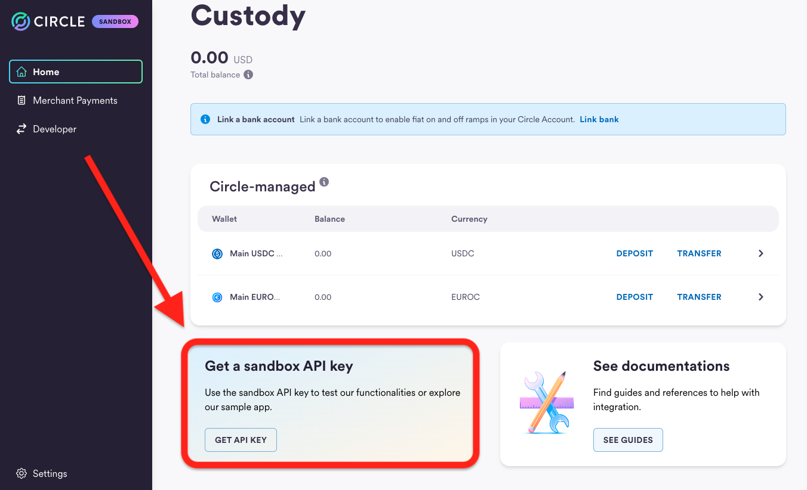
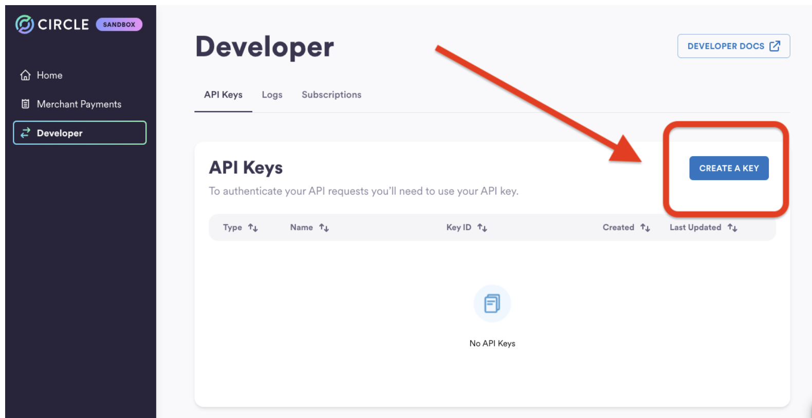
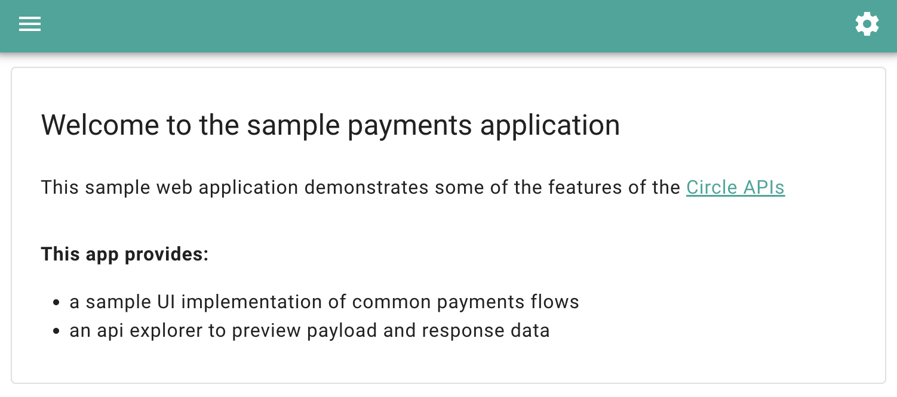
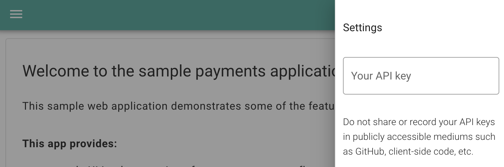
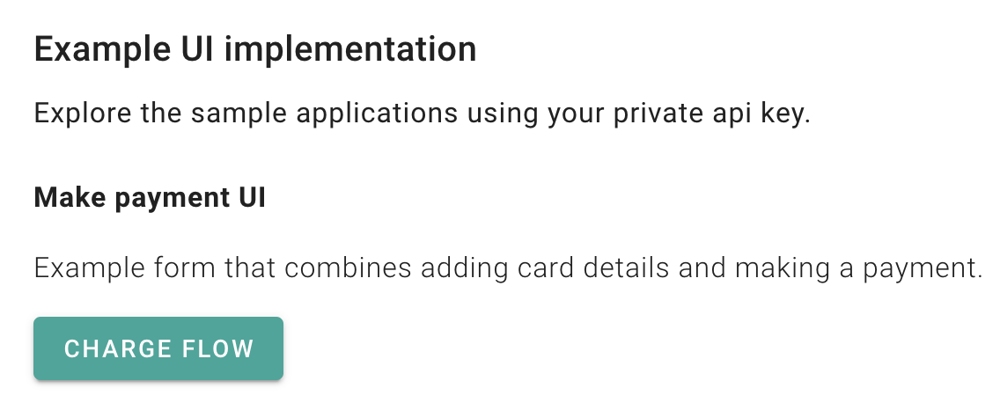
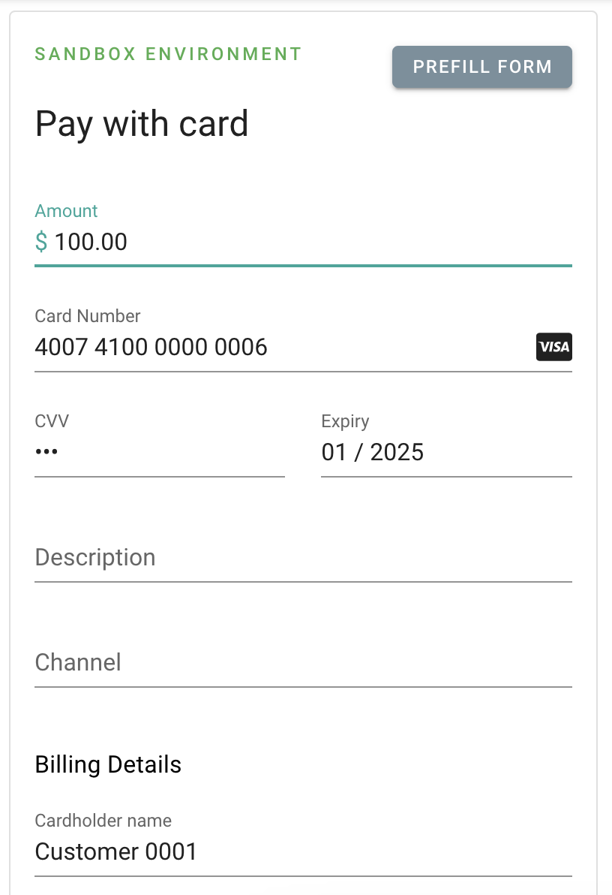
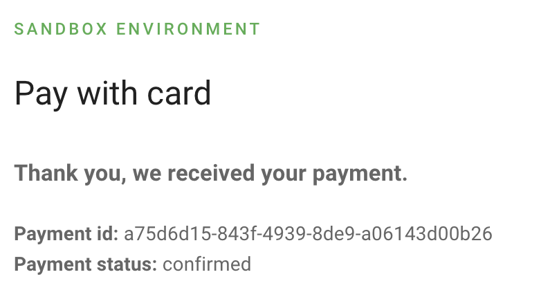
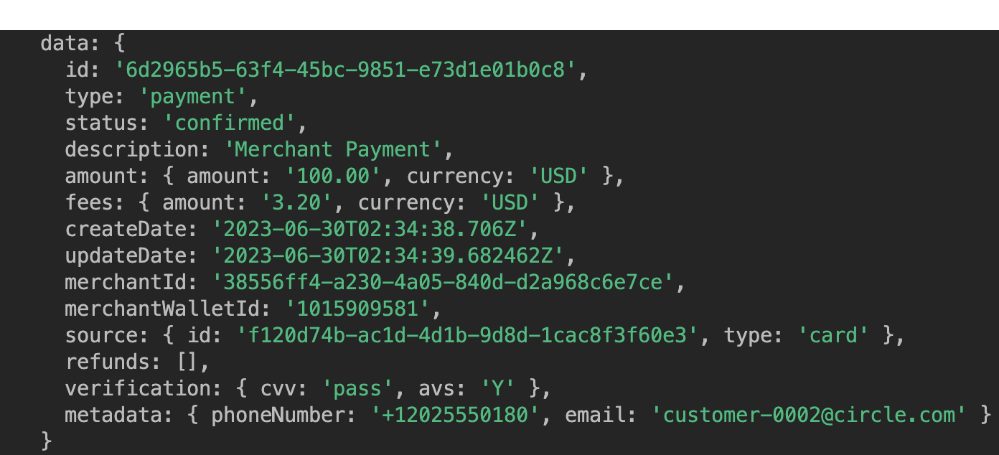

<h1>Getting Started with Circle</h1>


<h2>Account Set Up</h2>


The fastest way to onboard onto Circle is by heading over to [https://hackp.ac/Circle-Sandbox](https://hackp.ac/Circle-Sandbox) and signing up for a sandbox account. 

Circle’s sandbox environment is a development tool that allows you to safely test prototypes and integration without generating actual financial transactions. 

If you want to learn more about Circle’s sandbox environment, check out their sandbox [documentation](https://developers.circle.com/developer/docs/circle-apis-production-sandbox-environments). 




Once your sandbox account is set up, you can generate an API KEY which will give you the ability to leverage Circle’s API. 





Circle’s API is RestFul, so any programming language that can call a REST API will work well. They offer [SDKs](https://hackp.ac/circle-sdk) for JavaScript, Python and Java, making it even easier to use Circle’s services.

<h2>Download the Sample Application</h2>


Get started by downloading Circle’s sample application and running it locally on your machine. 

```
# Clone the sample app Github repository

git clone https://github.com/circlefin/payments-sample-app.git

# Change into sample app folder

cd payments-sample-app

# Create a .env file and configure the base url for api calls

echo BASE_URL=https://api-sandbox.circle.com > .env

# Install the dependencies

yarn install

# Run the sample app locally

yarn dev
```

Your sample application will be running on localhost:3011 and should look like the image below. 




Hit the settings gear on the top right corner of the application, input the entire API key you generated during the set up phase and hit enter to continue. (Remember to include the SAND_API_KEY: portion of the API key as well). 



<h2>Accepting your First Payment with Circle</h2>


Now that you have your API key submitted, let’s head over to the home page and accept a payment using Circle’s payment API. When you click the “Charge Flow” button, you’ll be redirected to a payment form. Go ahead and use the “Prefill Form” option, select any one of the test credit card numbers provided and input a payment amount. 



At the bottom of the form, you’ll find the option to make a payment. Go ahead and hit submit! 



It should take a second or so to process the payment. If your API Key was correctly input and your request form contained a valid card number with the necessary fields completed, then you should receive a confirmation similar to the image below! 

Congratulations! You’ve accepted your first credit card payment using Circle’s payment API! 




<h2>Programmatically Check the Status of your Card Payment</h2>


For this step, you’ll need the payment id you just received from your card payment and the API key we used in the Sample Application. 

We’re going to use Circle’s [get a payment](https://developers.circle.com/developer/reference/getpayment) endpoint and their [JavaScript SDK](https://hackp.ac/circle-sdk)!

Let’s open up a new terminal window and set up a new folder. 

```
mkdir circle-get && cd circle-get 

touch index.js

npm init

npm install @circle-fin/circle-sdk --save
```
 

You should now have a folder with a node_modules folder, an  index.js file, a package-lock.json file, and a package.json file. Take a look into your package.json file to confirm that you have the circle sdk dependency installed. 

```json
"dependencies": {
    "@circle-fin/circle-sdk": "^2.0.0"
  }
```

Since we will be using an import statement for the Circle SDK, we should also add the “type”:”module” key pair into our package.json file. 

```json
  "description": "",
  "type":"module",
  "main": "index.js",
```

Now that we have that out of the way, let’s dive into the Cirlce Payment API. 

As I mentioned earlier, we’ll be leveraging the ‘get a payment’ end point. 

Make sure you plug in your own API Key and the payment id from our Sample Application transaction. For the purposes of this demo, I went ahead and hard-coded these values, however, you should set up an .env file for your project and reference your API Key as an environment variable. 

*Note: if you need some help in doing that, you can reference this [article](https://www.codementor.io/@parthibakumarmurugesan/what-is-env-how-to-set-up-and-run-a-env-file-in-node-1pnyxw9yxj).*

```js

import { Circle, CircleEnvironments } from "@circle-fin/circle-sdk";

const circle = new Circle(

    '<your-api-key>',

    CircleEnvironments.sandbox      // API base url

);

async function checkCardPaymentStatus() {

    const paymentId = '<your-payment-id>'

    const resp = await circle.payments.getPayment(paymentId);

    console.log(resp.data);

}

checkCardPaymentStatus();

```

Jump back into the terminal and run the `node index.js` command. 

The terminal response should reflect the payment you submitted in the Sample Application earlier. 





<h2>Recap</h2>


Amazing! You’ve managed to set up your Circle Sandbox account, accept your first payment using your sandbox API Key, and check the status of that payment using the JavaScript and the Circle Payment API!   \
 \
For next steps, be sure to check out the following resources. They should help you on your way to building a full fledged application with Circle as your payment platform! 


* [Circle Developer Docs](https://hackp.ac/circle-developer-docs)
* [Circle Sample Application GitHub Repository](https://hackp.ac/circle-sampleapp)
* [Circle SDKs](https://hackp.ac/circle-sdk)
* [Circle Card Payments Documentation](https://developers.circle.com/developer/docs/circle-payments-api-quickstart)
* [Circle API Reference](https://hackp.ac/circle-api-reference)
